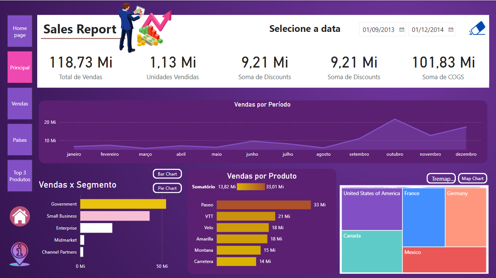
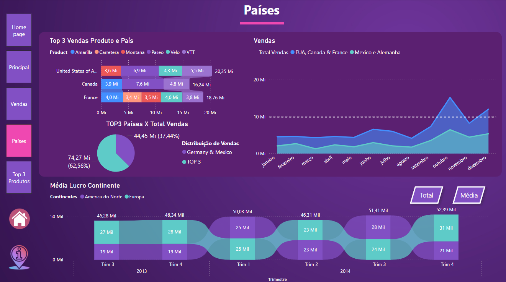
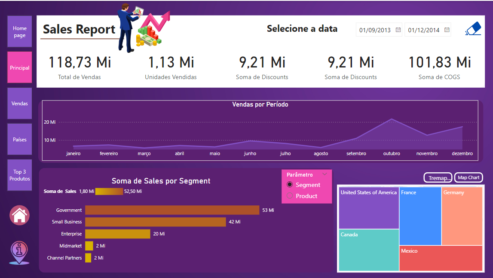

Desafio Desenvolvido no Bootcamp de Engenharia de Dados da DIO.

# Desafio 1
## Introdução

O desafio consistia em realizar uma análise de dados utilizando os conceitos aprendidos no módulo de fundamento de Data Analytics. Envolvia Conceitos como:

- Experiência do usuário
- Top N
- Compartimentação
- Agrupamento
- Dispersão
- Médidas como média, mediana e moda.

[Clique aqui](https://academiapme-my.sharepoint.com/:w:/r/personal/renato_dio_me/_layouts/15/Doc.aspx?sourcedoc=%7B17E619F9-2801-4845-89EE-9DA2CDF87495%7D&file=Descri%C3%A7%C3%A3o%20do%20desafio-Projeto%20de%20Data%20Analytics%20com%20Power%20BI.docx&action=default&mobileredirect=true) para ver os detalhes do desafio.

## Páginas
**Atenção Home Page e Principal forem fornecidas para o desenvolvimento do desafio. Para acessar a página e alguns ícones fornecidos [Clique Aqui](https://academiapme-my.sharepoint.com/personal/renato_dio_me/_layouts/15/onedrive.aspx?id=%2Fpersonal%2Frenato%5Fdio%5Fme%2FDocuments%2FDigital%20Innovation%20One%2Fslides%20aulas%20diversas%2FTrilhas%2FPower%20Bi%2FM%C3%B3dulo%205%20%2D%20Data%20Analytics%20%26%20Storytelling%20com%20Power%20BI%2FProjeto%20de%20Data%20Analytics%20com%20Power%20BI).**
### Homepage
 

### Principal
Página fornecida para o desafio. Foi trocado a cor do fundo dos gráficos em destaque e adicionado os botões.

### Detalhe de Vendas
A página em questão foi apresentada durante o desafio e refeita para fins de revisão.

### Países
A página foi criada para apresentar alguns dados referentes aos países e para usar conceitos de agrupamento.

### Top 3 Produtos Análise
Página criada para realizar a análise referente aos três principais produtos em relação a vendas. O objetivo principal aqui foi explorar os conceitos de Top N.

# Desafio 2:
O desafio final da formação consistia em aproveitar o relatório já criado e desenvolver gráficos com uso de paramêtros.O problema é que diferente dos botões, os paramêtros parecem não permitir muita personalização. Foram substituídos na página principal e na página de países gráficos com paramêtros. 

Principal:

Países:
